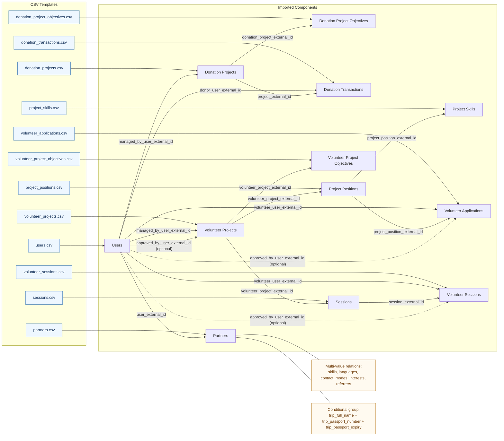
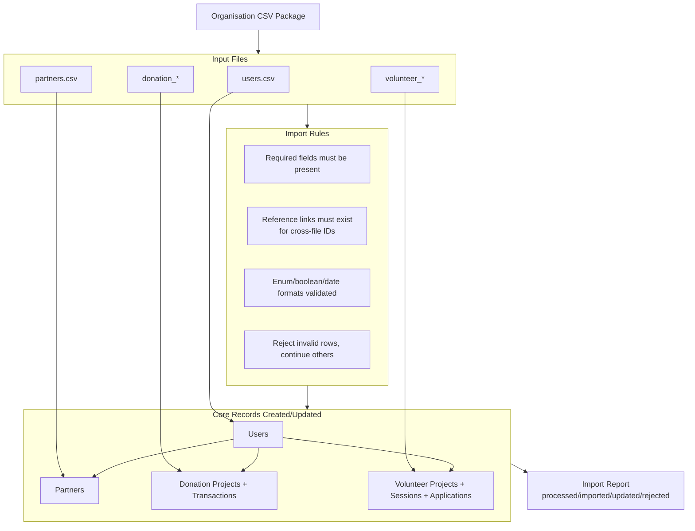

# Data Import Diagrams

Open Markdown Preview on this file to view both diagrams.

## 1) Detailed Relationships

```mermaid
flowchart LR
  classDef csv fill:#eef7ff,stroke:#2b6cb0,stroke-width:1px,color:#1a365d;
  classDef model fill:#f0fff4,stroke:#2f855a,stroke-width:1px,color:#1c4532;
  classDef link fill:#fffaf0,stroke:#b7791f,stroke-width:1px,color:#744210;

  subgraph CSV_Files[CSV Templates]
    UCSV[users.csv]:::csv
    PCSV[partners.csv]:::csv
    DPCSV[donation_projects.csv]:::csv
    DPOCSV[donation_project_objectives.csv]:::csv
    DTCV[donation_transactions.csv]:::csv
    VPCSV[volunteer_projects.csv]:::csv
    PPCSV[project_positions.csv]:::csv
    PSCSV[project_skills.csv]:::csv
    SCSV[sessions.csv]:::csv
    VPOCSV[volunteer_project_objectives.csv]:::csv
    VACSV[volunteer_applications.csv]:::csv
    VSCV[volunteer_sessions.csv]:::csv
  end

  subgraph Core_Models[Imported Components]
    U[Users]
    P[Partners]
    DP[Donation Projects]
    DPO[Donation Project Objectives]
    DT[Donation Transactions]
    VP[Volunteer Projects]
    PP[Project Positions]
    PS[Project Skills]
    S[Sessions]
    VPO[Volunteer Project Objectives]
    VA[Volunteer Applications]
    VS[Volunteer Sessions]
  end

  UCSV --> U
  PCSV --> P
  DPCSV --> DP
  DPOCSV --> DPO
  DTCV --> DT
  VPCSV --> VP
  PPCSV --> PP
  PSCSV --> PS
  SCSV --> S
  VPOCSV --> VPO
  VACSV --> VA
  VSCV --> VS

  U -- user_external_id --> P

  U -- managed_by_user_external_id --> DP
  DP -- donation_project_external_id --> DPO

  U -- donor_user_external_id --> DT
  DP -- project_external_id --> DT

  U -- managed_by_user_external_id --> VP
  U -. approved_by_user_external_id (optional) .-> VP

  VP -- volunteer_project_external_id --> PP
  PP -- project_position_external_id --> PS
  VP -- volunteer_project_external_id --> S
  VP -- volunteer_project_external_id --> VPO

  U -- volunteer_user_external_id --> VA
  PP -- project_position_external_id --> VA
  U -. approved_by_user_external_id (optional) .-> VA

  U -- volunteer_user_external_id --> VS
  S -- session_external_id --> VS
  U -. approved_by_user_external_id (optional) .-> VS

  P --- L1[Multi-value relations:\nskills, languages, contact_modes, interests, referrers]:::link
  P --- L2[Conditional group:\ntrip_full_name + trip_passport_number + trip_passport_expiry]:::link
```

## 2) Business Flow (Simplified)

```mermaid
flowchart TD
  O[Organisation CSV Package]

  subgraph Inputs[Input Files]
    U[users.csv]
    P[partners.csv]
    D[donation_*]
    V[volunteer_*]
  end

  subgraph Core[Core Records Created/Updated]
    Users[Users]
    Partners[Partners]
    Donations[Donation Projects + Transactions]
    Volunteers[Volunteer Projects + Sessions + Applications]
  end

  subgraph Rules[Import Rules]
    R1[Required fields must be present]
    R2[Reference links must exist\nfor cross-file IDs]
    R3[Enum/boolean/date formats validated]
    R4[Reject invalid rows, continue others]
  end

  Report[Import Report\nprocessed/imported/updated/rejected]

  O --> Inputs
  U --> Users
  P --> Partners
  D --> Donations
  V --> Volunteers

  Users --> Partners
  Users --> Donations
  Users --> Volunteers

  Inputs --> Rules
  Rules --> Core
  Core --> Report
```

## 3) Dependency Graph (Execution-Order Proof)

```mermaid
flowchart LR
  classDef stage fill:#eef7ff,stroke:#2b6cb0,stroke-width:1px,color:#1a365d;
  classDef ok fill:#f0fff4,stroke:#2f855a,stroke-width:1px,color:#1c4532;

  subgraph ORDER[Importer Execute Order]
    S1[1. users.csv]:::stage
    S2[2. partners.csv]:::stage
    S3[3. donation_projects.csv]:::stage
    S4[4. donation_project_objectives.csv]:::stage
    S5[5. donation_transactions.csv]:::stage
    S6[6. volunteer_projects.csv]:::stage
    S7[7. project_positions.csv]:::stage
    S8[8. project_skills.csv]:::stage
    S9[9. sessions.csv]:::stage
    S10[10. volunteer_project_objectives.csv]:::stage
    S11[11. volunteer_applications.csv]:::stage
    S12[12. volunteer_sessions.csv]:::stage
  end

  S1 --> S2 --> S3 --> S4 --> S5 --> S6 --> S7 --> S8 --> S9 --> S10 --> S11 --> S12

  S1 -- user_external_id --> S2
  S1 -- managed_by_user_external_id --> S3
  S3 -- donation_project_external_id --> S4
  S1 -- donor_user_external_id --> S5
  S3 -- project_external_id --> S5
  S1 -- managed_by_user_external_id --> S6
  S1 -. approved_by_user_external_id (optional) .-> S6
  S6 -- volunteer_project_external_id --> S7
  S7 -- project_position_external_id --> S8
  S6 -- volunteer_project_external_id --> S9
  S6 -- volunteer_project_external_id --> S10
  S1 -- volunteer_user_external_id --> S11
  S7 -- project_position_external_id --> S11
  S1 -. approved_by_user_external_id (optional) .-> S11
  S1 -- volunteer_user_external_id --> S12
  S9 -- session_external_id --> S12
  S1 -. approved_by_user_external_id (optional) .-> S12

  Proof[All dependency edges point from lower stage number to higher stage number\n=> valid topological execution order]:::ok
  S12 --> Proof
```
