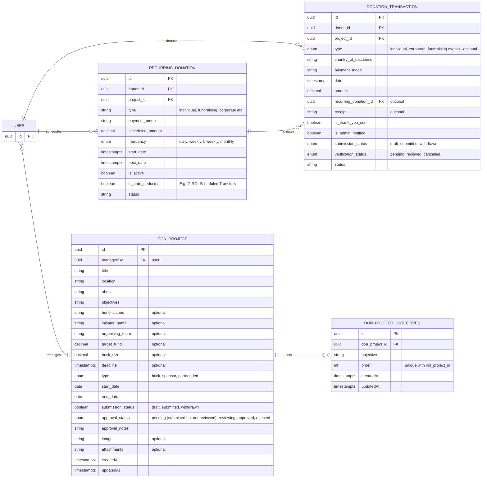

# Donor Management System

This document outlines the Entity-Relationship Diagram (ERD) for the database relating to the Donor Management System.

## Notes

## Questions

## Constraints

## ERD Diagram

