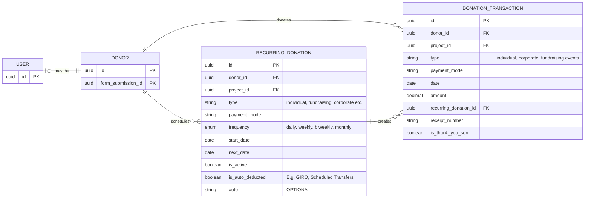

# Donor Management System

This document outlines the Entity-Relationship Diagram (ERD) for the database relating to the Donor Management System.

## Notes

- USER and DONOR: Optional one-to-one relationship (a USER may be a DONOR).

## Questions

- Should Donor Table combine with User?

## Constraints

## ERD Diagram

