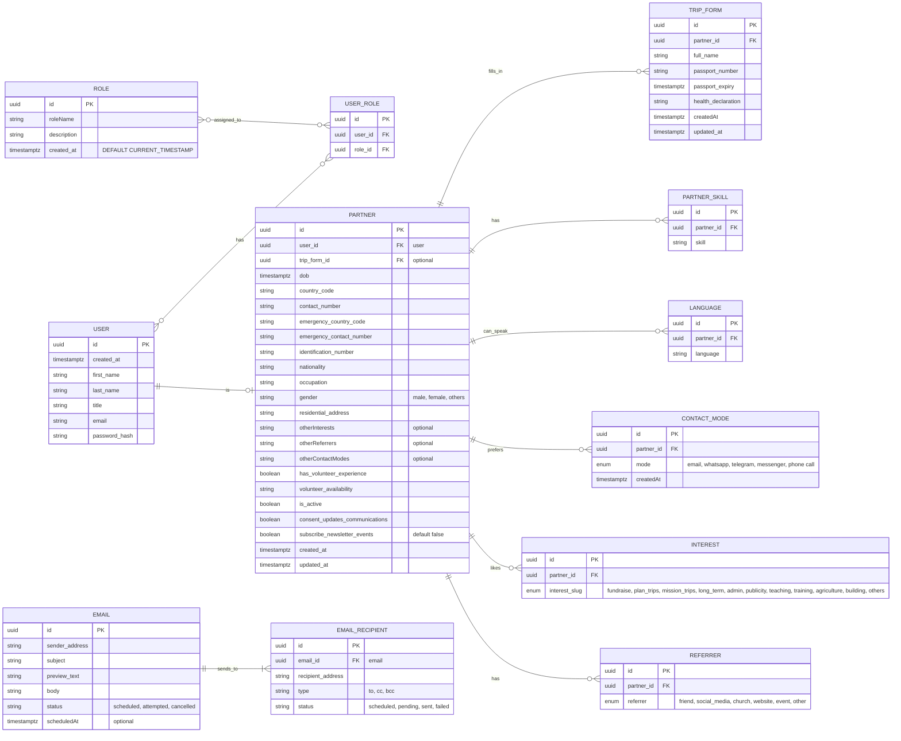

# Partner Management System

This document outlines the Entity-Relationship Diagram (ERD) for general PMS.

## Notes

## ERD Diagram

```mermaid
erDiagram
    direction LR
    USER }o--o{ USER_ROLE : has
    ROLE }o--o{ USER_ROLE : assigned_to
    USER ||--o| PARTNER : is
    PARTNER ||--o{ TRIP_FORM : fills_in
    PARTNER ||--o{ PARTNER_SKILL : has
    PARTNER ||--o{ LANGUAGE : can_speak
    PARTNER ||--o{ CONTACT_MODE : prefers
    PARTNER ||--o{ INTEREST : likes
    PARTNER ||--o{ REFERRER : has
    EMAIL ||--|{ EMAIL_RECIPIENT: sends_to

    USER {
        uuid id PK
        timestamptz created_at
        string first_name
        string last_name
        string title
        string email
        string password_hash
    }
    ROLE {
        uuid id PK
        string roleName
        string description
        timestamptz created_at "DEFAULT CURRENT_TIMESTAMP"
    }
    USER_ROLE {
        uuid id PK
        uuid user_id FK
        uuid role_id FK
    }

    PARTNER {
        uuid id PK
        uuid user_id FK "user"
        uuid trip_form_id FK "optional"
        timestamptz dob
        string country_code
        string contact_number
        string emergency_country_code
        string emergency_contact_number
        string identification_number
        string nationality
        string occupation
        string gender "male, female, others"
        string residential_address
        string otherInterests "optional"
        string otherReferrers "optional"
        string otherContactModes "optional"
        boolean has_volunteer_experience
        string volunteer_availability
        boolean is_active
        boolean consent_updates_communications
        boolean subscribe_newsletter_events "default false"
        timestamptz created_at
        timestamptz updated_at

    }
    TRIP_FORM {
        uuid id PK
        uuid partner_id FK
        string full_name
        string passport_number
        timestamptz passport_expiry
        string health_declaration
        timestamptz createdAt
        timestamptz updated_at
    }
    PARTNER_SKILL {
        uuid id PK
        uuid partner_id FK
        string skill
    }
    LANGUAGE {
        uuid id PK
        uuid partner_id FK
        string language
    }
    CONTACT_MODE {
        uuid id PK
        uuid partner_id FK
        enum mode "email, whatsapp, telegram, messenger, phone call"
        timestamptz createdAt
    }
    INTEREST {
        uuid id PK
        uuid partner_id FK
        enum interest_slug "fundraise, plan_trips, mission_trips, long_term, admin, publicity, teaching, training, agriculture, building, others"
    }
    REFERRER {
        uuid id PK
        uuid partner_id FK
        enum referrer "friend, social_media, church, website, event, other"
    }
    EMAIL {
        uuid id PK
        string sender_address
        string subject
        string preview_text
        string body
        string status "scheduled, attempted, cancelled"
        timestamptz scheduledAt "optional"
    }
    EMAIL_RECIPIENT {
        uuid id PK
        uuid email_id FK "email"
        string recipient_address
        string type "to, cc, bcc"
        string status "scheduled, pending, sent, failed"
    }


```
