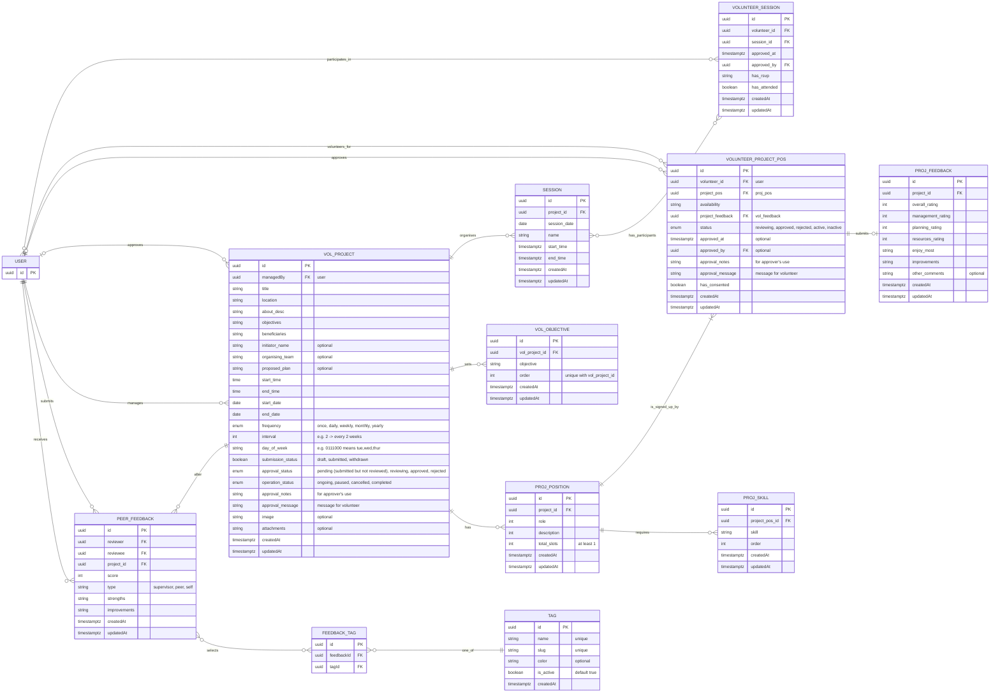

# Volunteer Management System

This document outlines the Entity-Relationship Diagram (ERD) for the database relating to the Volunteer Management System.

## Notes

## Questions

## Constraints

## ERD Diagram

