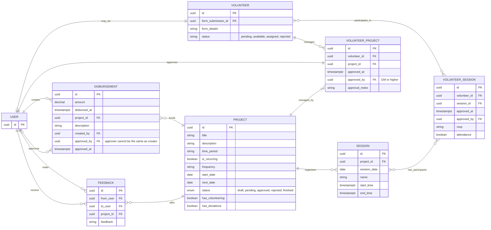

# Volunteer Management System

This document outlines the Entity-Relationship Diagram (ERD) for the database relating to the Volunteer Management System.

## Notes

- USER and VOLUNTEER: Optional one-to-one relationship (a USER may be a VOLUNTEER).

- Volunteer Table: References a form submission in `form-schema`

## Questions

- Should Volunteer Table combine with User?

## Constraints

- Trigger to manage only one volunteer profile per user
- Trigger to manage user approval of Volunteer_Project by role access
- Trigger to manage Projects created
- Trigger to ensure disbursement is created only after someone approves
- Scheduled Job / Trigger for Data retention for donations/receipts >= 7 years (configurable) with purge/anonymisation logs

## ERD Diagram

