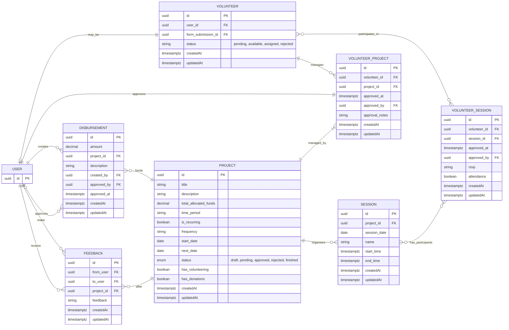

# Volunteer Management System

This document outlines the Entity-Relationship Diagram (ERD) for the database relating to the Volunteer Management System.

## Notes

- USER and VOLUNTEER: Optional one-to-one relationship (a USER may be a VOLUNTEER).

- Volunteer Table: References a form submission in `form-schema`

## Questions

-

## Constraints

- Scheduled Job / Trigger for Data retention for donations/receipts >= 7 years (configurable) with purge/anonymisation logs

## ERD Diagram

