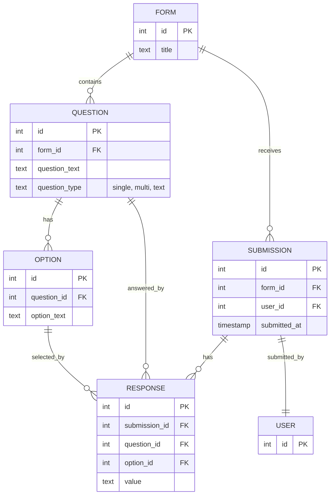

## Forms Management ERD Diagram

```mermaid
erDiagram
    direction TB
    FORM ||--o{ QUESTION : contains
    QUESTION ||--o{ OPTION : has
    FORM ||--o{ SUBMISSION : receives
    SUBMISSION ||--o{ RESPONSE : has
    QUESTION ||--o{ RESPONSE : answered_by
    OPTION ||--o{ RESPONSE : selected_by
    SUBMISSION ||--|| USER : submitted_by

    FORM {
        int id PK
        text title
    }
    QUESTION {
        int id PK
        int form_id FK
        text question_text
        text question_type "single, multi, text"
    }
    OPTION {
        int id PK
        int question_id FK
        text option_text
    }
    SUBMISSION {
        int id PK
        int form_id FK
        int user_id FK
        timestamp submitted_at
    }
    RESPONSE {
        int id PK
        int submission_id FK
        int question_id FK
        int option_id FK
        text value
    }
    USER {
        int id PK
    }
```
