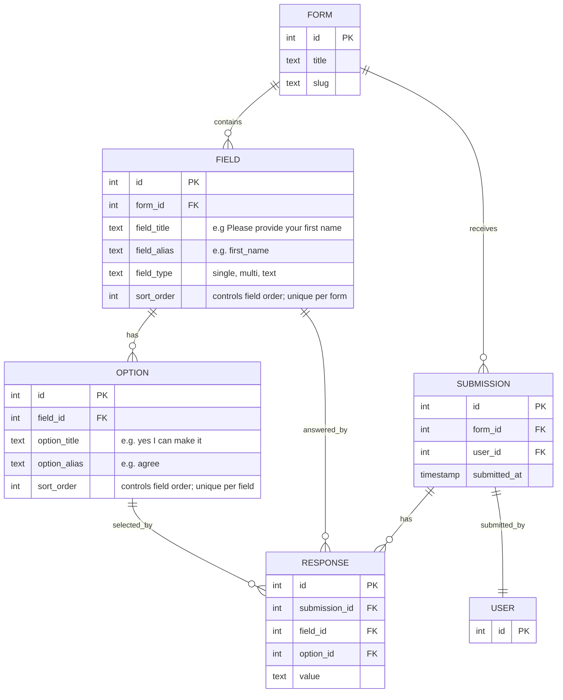

## Forms Management ERD Diagram

```mermaid
erDiagram
    direction TB
    FORM ||--o{ FIELD : contains
    FIELD ||--o{ OPTION : has
    FORM ||--o{ SUBMISSION : receives
    SUBMISSION ||--o{ RESPONSE : has
    FIELD ||--o{ RESPONSE : answered_by
    OPTION ||--o{ RESPONSE : selected_by
    SUBMISSION ||--|| USER : submitted_by

    FORM {
        int id PK
        text title
        text slug
    }
    FIELD {
        int id PK
        int form_id FK
        text field_title "e.g Please provide your first name"
        text field_alias "e.g. first_name"
        text field_type "single, multi, text"
        int sort_order "controls field order; unique per form"
    }
    OPTION {
        int id PK
        int field_id FK
        text option_title "e.g. yes I can make it"
        text option_alias "e.g. agree"
        int sort_order "controls field order; unique per field"
    }
    SUBMISSION {
        int id PK
        int form_id FK
        int user_id FK
        timestamp submitted_at
    }
    RESPONSE {
        int id PK
        int submission_id FK
        int field_id FK
        int option_id FK
        text value
    }
    USER {
        int id PK
    }
```
